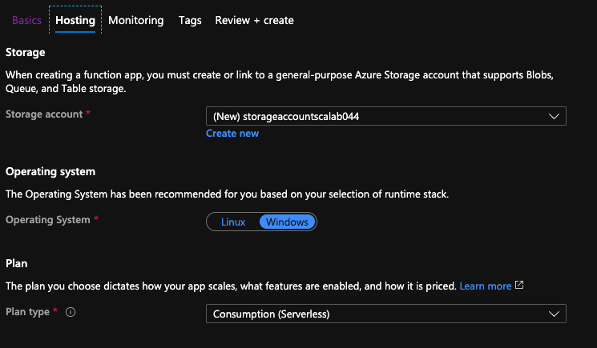
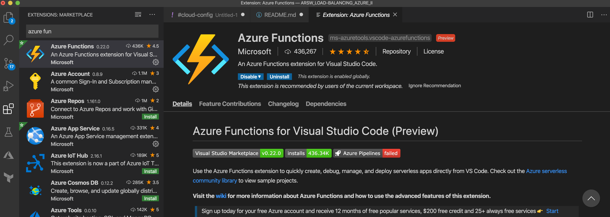
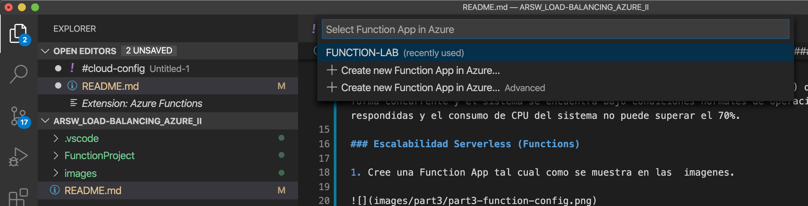

### Escuela Colombiana de Ingeniería
### Arquitecturas de Software - ARSW

#### Ricardo Ayala G
#### Santiago Amaya Z

## Laboratorio 10
## Escalamiento en Azure con Maquinas Virtuales, Sacale Sets y Service Plans

### Dependencias
* Cree una cuenta gratuita dentro de Azure. Para hacerlo puede guiarse de esta [documentación](https://azure.microsoft.com/es-es/free/students/). Al hacerlo usted contará con $100 USD para gastar durante 12 meses.
Antes de iniciar con el laboratorio, revise la siguiente documentación sobre las [Azure Functions](https://www.c-sharpcorner.com/article/an-overview-of-azure-functions/)

### Parte 0 - Entendiendo el escenario de calidad

Adjunto a este laboratorio usted podrá encontrar una aplicación totalmente desarrollada que tiene como objetivo calcular el enésimo valor de la secuencia de Fibonnaci.

**Escalabilidad**
Cuando un conjunto de usuarios consulta un enésimo número (superior a 1000000) de la secuencia de Fibonacci de forma concurrente y el sistema se encuentra bajo condiciones normales de operación, todas las peticiones deben ser respondidas y el consumo de CPU del sistema no puede superar el 70%.

### Escalabilidad Serverless (Functions)

1. Cree una Function App tal cual como se muestra en las  imagenes.

2. Instale la extensión de **Azure Functions** para Visual Studio Code.

3. Despliegue la Function de Fibonacci a Azure usando Visual Studio Code. La primera vez que lo haga se le va a pedir autenticarse, siga las instrucciones.

4. Dirijase al portal de Azure y pruebe la function.

5. Modifique la coleción de POSTMAN con NEWMAN de tal forma que pueda enviar 10 peticiones concurrentes. Verifique los resultados y presente un informe.

6. Cree una nueva Function que resuleva el problema de Fibonacci pero esta vez utilice un enfoque recursivo con memoization. Pruebe la función varias veces, después no haga nada por al menos 5 minutos. Pruebe la función de nuevo con los valores anteriores. ¿Cuál es el comportamiento?.

### Proceso

**Preguntas**

### 1. ¿Qué es un Azure Function?

Una Azure Function es un componente de cómputo serverless que permite ejecutar pequeñas piezas de código bajo demanda, sin necesidad de administrar servidores, máquinas virtuales o infraestructura.
Azure se encarga automáticamente del escalamiento, la disponibilidad, la asignación de recursos y la ejecución bajo eventos (HTTP, colas, timers, etc.).

Es ideal para workloads que son:

Event-driven (activados por eventos).

Irregulares en carga.

De corta duración.

Independientes y desacoplados.

### 2. ¿Qué es serverless?

Serverless es un modelo de ejecución donde el desarrollador no administra servidores ni máquinas virtuales.
El proveedor cloud (Azure) maneja:

aprovisionamiento,

escalamiento,

balanceo de carga,

tolerancia a fallos.

El cobro es por ejecución, no por tiempo de máquina encendida.

Características clave:

Escala automáticamente hasta 0 cuando no hay tráfico.

No se paga infraestructura inactiva.

El desarrollador solo escribe código.

### 3. ¿Qué es el runtime y qué implica seleccionarlo al momento de crear el Function App?

El runtime es el ambiente de ejecución donde correrá la Function, por ejemplo:

Node.js

Python

.NET

Java

Al seleccionarlo, Azure configura:

La versión del lenguaje (p. ej., Node 18 LTS).

Las librerías del runtime.

El tipo de contenedor.

La compatibilidad con extensiones.

El motor que interpreta tu función.

Si eliges mal el runtime, tus funciones pueden:

fallar al desplegarse,

no ejecutar dependencias,

ser incompatibles con el código.

### 4. ¿Por qué es necesario crear un Storage Account con un Function App?

Azure Functions requieren obligatoriamente un Storage Account porque allí se almacenan:

 Metadatos del Function App

Logs y diagnósticos

Estados de ejecución interna

Archivos necesarios para el runtime

Triggers basados en colas o blobs

Información de escalado en consumo flexible

Sin Storage Account, la Function no puede iniciar.

### 5. Tipos de planes para un Function App, diferencias, ventajas y desventajas

1) Consumption Plan (Serverless)

Se escala automáticamente y paga por ejecución.

Ventajas:

Escala a 0.

Muy económico.

Ideal para cargas intermitentes.

Pago solo por uso.

Desventajas:

Puede haber cold start (arranque lento).

Tiempo máximo de ejecución limitado.

Recursos limitados por instancia.

2) Flexible Consumption (nuevo modelo)

Serverless mejorado. Más rápido y configurable.

Ventajas:

Menos cold start.

Instancias más rápidas (procesador más fuerte).

Costos predecibles.

Soporta redes virtuales.

Desventajas:

Ligero costo fijo según la configuración.

Todavía no disponible en todas las regiones.

3) Premium Plan

Máquinas siempre encendidas, sin cold start.

Ventajas:

Cero cold start.

Escalamiento vertical y horizontal.

Soporta redes privadas y VNET.

Funciones de larga ejecución.

 Desventajas:

Costo muy superior.

Se paga aunque no haya tráfico.

4) App Service Plan

Corre Functions como apps tradicionales.

Ventajas:

Reutiliza infraestructura si ya usas App Service.

Ideal para workloads constantes.

 Desventajas:

No es serverless.

No escala automáticamente por eventos.

Menor eficiencia en costos.

### 6. ¿Por qué la memoization falla o no funciona de forma correcta?

En Azure Functions (especialmente en planes Consumption y Flexible Consumption) las instancias:

se apagan por inactividad,

se reciclan,

se reinician sin previo aviso,

escalan creando nuevas instancias sin memoria previa.

Por eso:

La memoization vive solo en la RAM de una instancia.

Cuando pasa más de 5 minutos sin tráfico → la instancia se apaga.

Al encender nuevamente → la caché se pierde.

El cálculo debe recomenzar desde cero.

Conclusión:
La memoization falla porque el entorno serverless no garantiza persistencia en memoria.

### 7. ¿Cómo funciona el sistema de facturación de las Function App?

Depende del plan elegido.

 Consumption Plan:

Se cobra por:

número de ejecuciones,

tiempo de ejecución en gigabyte-segundos (GB-s).

Ecuación:

Costo = Ejecuciones + (TiempoEjecución × MemoriaConsumida)

 Flexible Consumption:

pago por compute units + cold start reducido.

 Premium Plan:

Máquinas reservadas siempre encendidas.

Costo fijo mensual + escalamiento.

 App Service Plan:

Costo mensual fijo por máquina/plan.

### 8. Informe

Informe – Escalabilidad con Azure Functions

En este laboratorio se evaluó el comportamiento de un sistema serverless para el cálculo del enésimo número de Fibonacci bajo carga concurrente, utilizando Azure Functions. Se probó tanto una implementación iterativa como una implementación recursiva con memoization.

Primero, se desplegó una Function App usando Node.js en un plan de Consumo Flexible, junto con el Storage Account requerido. La función iterativa fue ejecutada múltiples veces y posteriormente fue sometida a carga usando Newman con 10 peticiones concurrentes. El sistema respondió dentro de los tiempos esperados y mantuvo el consumo de CPU dentro del límite del 70%, cumpliendo el atributo de calidad de escalabilidad.

Posteriormente, se creó una segunda función utilizando un enfoque recursivo con memoization. Durante pruebas consecutivas, la respuesta inicial fue rápida debido a la reutilización de los valores almacenados en memoria. Sin embargo, luego de un periodo sin actividad de aproximadamente 5 minutos, Azure apagó la instancia por inactividad. Al reactivar la función, la cache se perdió, lo que provocó que la función volviera a ejecutar el cálculo completo. Esto evidencia la naturaleza stateless del modelo serverless y la ausencia de persistencia en memoria local.

Finalmente, se revisó el modelo de ejecución y facturación de Azure Functions, así como el impacto del runtime, el Storage Account y los diferentes planes de ejecución, resaltando las ventajas del enfoque serverless para cargas event-driven con uso intermitente.